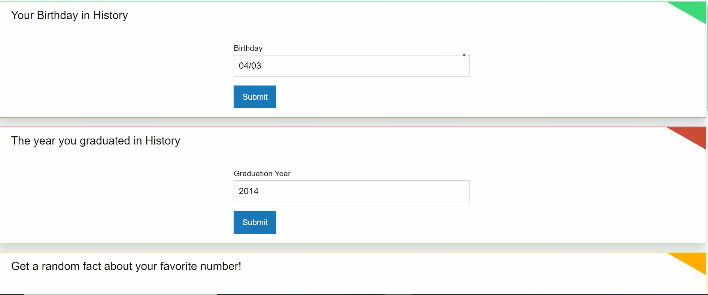

## Team Codename : KJB

## Group Members : Kwaku Asare, Joseluis Sierra, Braenaan Vaughan

## Project Title : Random Number & Day Facts!

## Github Deployed
https://kwakuasare.github.io/codeproject/
 

## Table of Contents
* [Description](#Description)
* [User Story](#UserStory)
* [Installation](#installation)
* [Usage](#Usage)
* [Screenshots](#Screenshots)
* [Credits](#credits)
* [Repository Link](#Repositories)
* [License](#license)

## Description
Random Number and Day Facts(RANDY) App is a fun easy-to-use application that allows users to get random facts based on the numbers that they put into the application. Users can put i their birthday, graduation day house number etc and they will be provided with a random fact based on their input. Users can also be provided with a fun random activity if they are bored.

## UserStory
As a user with a curious mind 
I WANT to be able to enter my birthday or graduation year or any other number
SO THAT I CAN get a random fact or information based on my input and get activities suggested to me

## Installation
No installation needed 😎

Users can follow the link to the deployed site and begin using it immediately

## Usage
Users can get a random fact based on the numbers that they input.
Users can get a random fun activity suggested to them if they are bored.
No account necessary.

## Screenshots

## Credits
[Braenaan Vaughan](https://github.com/BraenaanV)

[Kwaku Asare Owusu](https://github.com/KwakuAsare)

[Joseluis Sierra](https://github.com/topsynco)

## Repositories
- [Github Deployed Link](https://kwakuasare.github.io/codeproject)
- [GitHub Repository](https://github.com/KwakuAsare/codeproject)
 

## License
MIT: <https://rem.mit-license.org>

### Badges
(https://img.shields.io/badge/license-[MIT]-blue.svg)
(https://img.shields.io/github/languages/top/nielsenjared/badmath)

---
© 2020 - Kwaku Asare Owusu, Joseluis Sierra,  Braenaan Vaughan. All Rights Reserved.